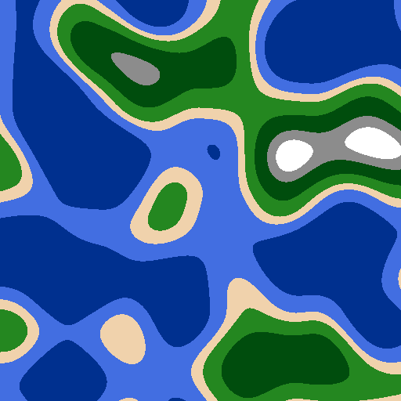

<h1 align="center">2D World Generator</h1>

<h2 align="center">Explanation</h2>

This program allows you to generate png images of a 2D procedural world. Thanks to Perlin's noise 

<h1></h1>

<h2 align="center">How to use it? </h2>
<h3 >Requirements</h3>
<ul>
    <li>Python 3.x.x  </li>
    <li>Noise (pip install noise) </li>
    <li>Pillow (pip install Pillow) </li>
</ul>

<h3> Working </h3>

 Just run the program, it will generate an image in the image directory 

<h1></h1>

<h2 align="center">Arguments for the command line</h2>
<ul>
    <li>
        --name : Changes the name of the generated image
    </li>
    <li>
        --image : Changes the size of the image. Default (512,512)
    </li>
    <li>
        --seed : Seed of the world. (To get the same map)
    </li>
    <li>
        
--scale : Change the scale of a world. By default it is 130. If you choose smaller it will enlarge the map and vice versa.   Example with 2 maps, having the same seed but not the same Scale.

        

        
        
        

    </li>
    <li>
        
--octaves :
        Level of detail that the map will include. By default it is 7. The fewer octaves there are, the less detail there will be on the map   Example of 2 maps with the same seed, but not the same number of Octaves
        

        

        
        
        

    </li>
    <li>
        
--lacunarity :
        Level of detail by octave. By default it is 1.9. The fewer lacunarity there are, the less detail there will by Octave (Very efficient to increase both - Lacunarity & Octave)   Example of 2 maps with the same seed, but not the same Lacunarity
        

        

        
        
        

    </li>
    <li>
        
--persistence :
        Octave contribution rate for the map. By default it is 0.35. The fewer persistence there are, less will contribute the octaves to the generation of the map   Example of 2 maps with the same seed, but not the same Persistence
        

        

        
        
        

    </li>
</ul>
<h1></h1>
<h2 align="center">Idea ?</h2>

If you have any ideas to improve this program, don't hesitate to submit it! And if you have any questions, don't hesitate to contact me 

<h1></h1>

<h2 align="center">Have fun! </h2>
